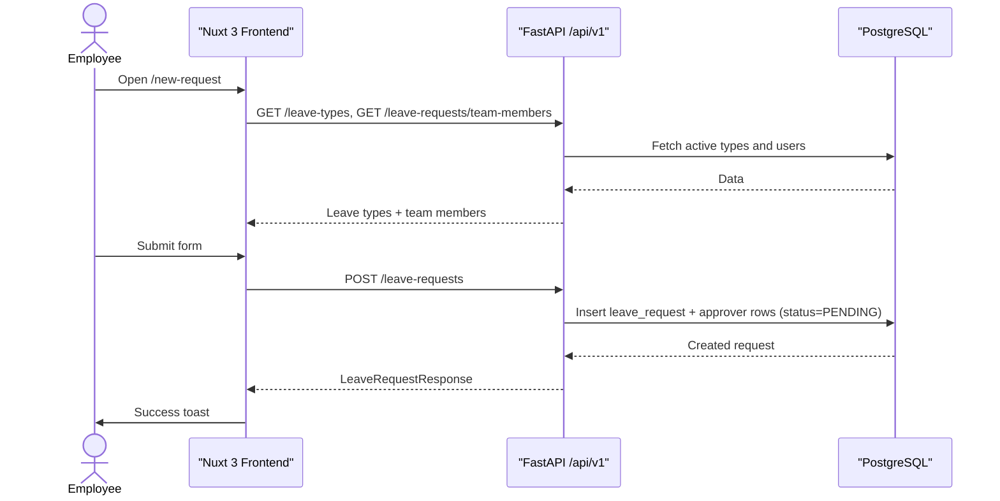
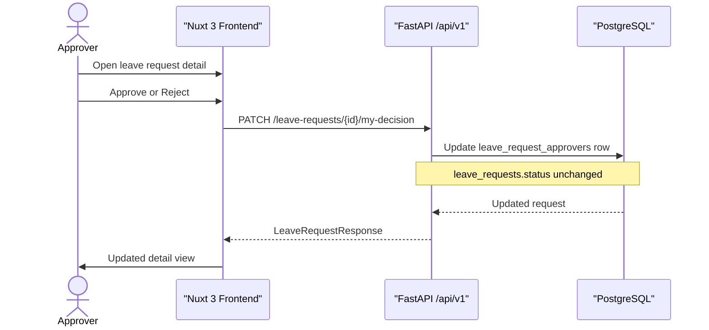
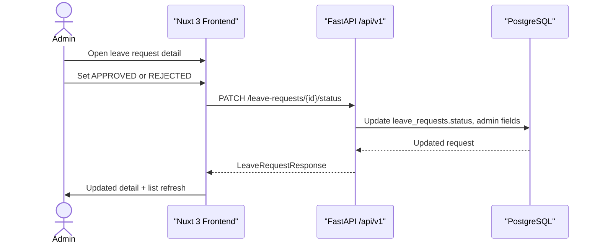

## Background

Одоогийн байдлаар ажилтнууд чөлөөний хүсэлтээ имэйл, чат эсвэл гар бичмэлээр илгээдэг. Энэ нь дараах асуудлуудыг үүсгэдэг:

- Хэн ямар өдөр чөлөө авсан, хэн зөвшөөрсөн гэдэг нь нэг газар төвлөрдөггүй.
- Багийн гишүүний зөвшөөрөл болон HR/админы эцсийн шийдвэр тусдаа харагдахгүй.
- Өнгөрсөн хугацаанд зөвшөөрөгдсөн чөлөөний мэдээллийг хурдан харах боломж хязгаарлагдмал.
- Админ талд нэгдсэн статистик, тайлан гаргахад нэмэлт гар ажиллагаа шаарддаг.

Үүнийг шийдэхийн тулд **дотоодын “Leave Management” вэб апп** хэрэгтэй. Апп нь:

- Ажилтан чөлөөний хүсэлт үүсгэж, багийн гишүүдийг зөвшөөрөгчөөр сонгоно.
- Багийн гишүүд өөрийн зөвшөөрлийг бүртгэнэ.
- Админ эцсийн төлөв (`APPROVED` / `REJECTED`) өгнө.
- Бүх ажилтан зөвшөөрөгдсөн чөлөөний жагсаалтыг нүүр хуудсаас харна.
- Админ статистик болон тайлан гаргана.

Технологи: **FastAPI (REST)** backend, **Nuxt 3** frontend, **PostgreSQL**, **Docker Compose**.

---

## Terminology

| Term              | Definition                                                                 |
| ----------------- | -------------------------------------------------------------------------- |
| Leave request     | Ажилтны нэг өдрийн чөлөөний хүсэлт (огноо + эхлэх/дуусах цаг)            |
| Requester         | Хүсэлт үүсгэсэн ажилтан                                                   |
| Approver          | Хүсэлтэд сонгогдсон багийн гишүүн — зөвшөөрөх/татгалзах шийдвэр гаргана   |
| Admin             | Эцсийн төлөв (`APPROVED` / `REJECTED`) өгөх эрхтэй хэрэглэгч               |
| Leave type        | Чөлөөний төрөл (жишээ нь: ээлжийн амралт, зайнаас ажиллах)                 |
| Approver decision | Багийн гишүүний тусдаа шийдвэр (`PENDING`, `APPROVED`, `REJECTED`)         |
| Request status    | Хүсэлтийн ерөнхий төлөв — админы эцсийн шийдвэр (`PENDING`, `APPROVED`, `REJECTED`) |

---

## Requirements

- **Authentication**

  - Хэрэглэгч имэйл + нууц үгээр нэвтэрнэ (`POST /api/v1/auth/login`).
  - JWT Bearer token ашиглана.
  - Идэвхгүй хэрэглэгч нэвтрэх боломжгүй.

- **Create leave request**

  - Ажилтан дараах талбаруудтай хүсэлт үүсгэнэ:
    - чөлөөний төрөл (`leave_type_id`)
    - огноо (`start_date`)
    - эхлэх / дуусах цаг (`start_time`, `end_time`)
    - тайлбар (`description`, заавал биш)
    - нэг эсвэл олон зөвшөөрөгч (`approver_ids`, заавал дор хаяж нэг)
  - Өөрийгөө зөвшөөрөгчөөр сонгох боломжгүй.
  - Дуусах цаг эхлэх цагаас хойш байх ёстой.
  - Үүсгэсэн хүсэлтийн ерөнхий төлөв `PENDING` байна.

- **Approver decision**

  - Сонгогдсон зөвшөөрөгч хүсэлтийн дэлгэрэнгүй дээр `APPROVED` эсвэл `REJECTED` шийдвэр өгнө.
  - Татгалзах үед тайлбар заавал.
  - Зөвшөөрөгчийн шийдвэр хүсэлтийн ерөнхий төлөвийг автоматаар өөрчлөхгүй — зөвхөн тухайн зөвшөөрөгчийн мөр шинэчлэгдэнэ.

- **Admin final status**

  - Зөвхөн `ADMIN` ролтой хэрэглэгч хүсэлтийн ерөнхий төлөвийг `APPROVED` эсвэл `REJECTED` болгоно.
  - Татгалзах үед тайлбар заавал.
  - Админы шийдвэр, нэр, огноо хадгалагдана.

- **Description visibility**

  - Хүсэлтийн тайлбарыг зөвхөн дараах хэрэглэгчид харна:
    - хүсэлт үүсгэгч
    - тухайн хүсэлтийн зөвшөөрөгчид
    - админ
  - Бусад хэрэглэгчид жагсаалтад тайлбар харагдахгүй.

- **Issue visibility (leave list)**

  - Бүх нэвтэрсэн хэрэглэгч бүх хүсэлтийн жагсаалтыг харна (`GET /leave-requests`).
  - Шүүлтүүр:
    - огноо (`date`) эсвэл сар (`year` + `month`)
    - статус (frontend дээр)
    - чөлөөний төрөл (frontend дээр)
    - нэр / имэйлээр хайлт (frontend дээр)
  - Өөрийн хүсэлтүүдийг тусад нь харна (`GET /leave-requests/mine`).

- **Recent approved leaves (home)**

  - Нүүр хуудас дээр зөвшөөрөгдсөн (`APPROVED`) хүсэлтүүдийг өдрөөр бүлэглэн харуулна.
  - Огнооны хүрээ: `from_date` + `to_date` (хамгийн ихдээ 90 хоног) эсвэл `days` (1–90, default 7 хоног).
  - Frontend дээр нэмэлт шүүлтүүр: чөлөөний төрөл, хайлт, эрэмбэлэлт.

- **Admin dashboard**

  - Нийт хэрэглэгч, хүсэлт, төлөвөөр ангилсан тоо, нийт чөлөөний өдөр.
  - Чөлөөний төрлөөр статистик.
  - Сарын чиг хандлага (1–24 сар).
  - Тайлан: огноо, ажилтан, чөлөөний төрөл, статусаар шүүж гаргах, Excel экспорт (frontend).

- **Responsive UI**

  - Nuxt 3 + Tailwind CSS ашиглан mobile-first загвар.
  - Sidebar, хүснэгт, modal зэрэг нь жижиг дэлгэцэд ажиллана.

---

## Business logic

1. **Login**

   - Хэрэглэгч имэйл + нууц үг илгээнэ.
   - Backend JWT `access_token` буцаана.
   - Frontend token-ийг cookie-д хадгалж, `Authorization: Bearer` header-ээр API дуудна.

2. **Create leave request**

   - Ажилтан “New Request” хуудсаар чөлөөний төрөл, огноо, цаг, тайлбар, зөвшөөрөгчдийг бөглөнө.
   - Backend `leave_requests` мөр үүсгэж, `leave_request_approvers` мөр бүртгэнэ.
   - Бүх зөвшөөрөгчийн эхлээд `PENDING` шийдвэртэй.
   - Ерөнхий төлөв `PENDING` хэвээр үлдэнэ.

3. **View leave requests**

   - Бүх хэрэглэгч `/leave-requests` жагсаалтыг харна.
   - Өдөр эсвэл сараар backend шүүлт хийнэ; статус, төрөл, хайлтыг frontend шүүнэ.
   - Мөр дээр дарахад дэлгэрэнгүй modal нээгдэнэ.

4. **Approver acts on request**

   - Зөвшөөрөгч дэлгэрэнгүй дээр зөвшөөрөх/татгалзах.
   - Backend `leave_request_approvers.decision`, `decided_at`, `rejection_reason` шинэчилнэ.
   - Хүсэлтийн `status` талбар өөрчлөгдөхгүй.

5. **Admin final decision**

   - Админ дэлгэрэнгүй дээр `APPROVED` эсвэл `REJECTED` сонгоно.
   - Backend `leave_requests.status`, `admin_id`, `admin_decision`, `admin_decided_at` шинэчилнэ.
   - Татгалзсан тохиолдолд `admin_rejection_reason` хадгална.

6. **View recent approved leaves**

   - Нүүр хуудас `GET /leave-requests/recent-approved` дуудна.
   - Зөвхөн `APPROVED` төлөвтэй, сонгосон огнооны хүрээнд байгаа хүсэлтүүдийг өдрөөр бүлэглэн харуулна.

7. **Admin report**

   - Админ шүүлтүүр сонгож тайлан үүсгэнэ (`GET /admin/reports/leaves`).
   - Нэг өдрийн чөлөөний цагийг 8 цаг = 1 өдөр гэж тооцно.

---

## Out of scope

- Teams / имэйл / push мэдэгдэл.
- GitHub эсвэл гадны системтэй синк.
- Зураг хавсаргах.
- Олон өдөр үргэлжлэх чөлөө (одоогоор нэг `start_date` + цагийн хүрээ).
- Зөвшөөрөгчдийн бүгд зөвшөөрсөн тохиолдолд автоматаар `APPROVED` болгох.
- Үйл ажиллагааны audit log (тухайн бүртгэл хадгалах хүснэгт байхгүй).
- Чөлөөний үлдэгдэл (balance) backend API — одоогоор frontend дээр статик жишээ утга.
- Хэрэглэгч CRUD (`/users` endpoint байхгүй, seed-ээр урьдчилан үүсгэсэн).
- Нэг хүсэлтийг ID-аар авах тусдаа `GET /leave-requests/{id}` endpoint.

---

## Database schema

PostgreSQL. UUID primary key, `created_at` / `updated_at` бүх үндсэн хүснэгтэд.

### `users`

| Column     | Type         | Notes                          |
| ---------- | ------------ | ------------------------------ |
| id         | UUID         | PK                             |
| email      | VARCHAR      | unique, lowercase              |
| password   | VARCHAR      | hashed                         |
| name       | VARCHAR      |                                |
| role       | user_role    | `USER`, `APPROVER`, `ADMIN`    |
| is_active  | BOOLEAN      | default true                   |

### `leave_types`

| Column    | Type    | Notes              |
| --------- | ------- | ------------------ |
| id        | UUID    | PK                 |
| name      | VARCHAR | unique             |
| is_active | BOOLEAN | default true       |

Seed жишээ: Цалингүй чөлөө, цалинтай чөлөө, зайнаас ажиллах, ээлжийн амралт, үдээс өмнөх чөлөө, үдээс хойно чөлөө.

### `leave_requests`

| Column                 | Type                    | Notes                              |
| ---------------------- | ----------------------- | ---------------------------------- |
| id                     | UUID                    | PK                                 |
| user_id                | UUID                    | FK → users (requester)             |
| leave_type_id          | UUID                    | FK → leave_types                   |
| start_date             | DATE                    |                                    |
| start_time             | TIME                    |                                    |
| end_time               | TIME                    | must be after start_time           |
| description            | TEXT                    | nullable                           |
| status                 | leave_request_status    | `PENDING`, `APPROVED`, `REJECTED`  |
| admin_id               | UUID                    | FK → users, nullable               |
| admin_decision         | admin_decision_status   | nullable                           |
| admin_rejection_reason | TEXT                    | nullable                           |
| admin_decided_at       | TIMESTAMPTZ             | nullable                           |

### `leave_request_approvers`

| Column           | Type                    | Notes                              |
| ---------------- | ----------------------- | ---------------------------------- |
| id               | UUID                    | PK                                 |
| leave_request_id | UUID                    | FK → leave_requests                |
| approver_id      | UUID                    | FK → users                         |
| decision         | approver_decision_status| `PENDING`, `APPROVED`, `REJECTED`   |
| rejection_reason | TEXT                    | nullable                           |
| decided_at       | TIMESTAMPTZ             | nullable                           |

Unique: (`leave_request_id`, `approver_id`).

---

## REST API

Base path: `/api/v1`. Бүх endpoint (login-оос бусад) `Authorization: Bearer <token>` шаарддаг.

### Auth

| Method | Path        | Description              |
| ------ | ----------- | ------------------------ |
| POST   | `/auth/login` | OAuth2 form: `username` (email), `password` → `Token` |
| GET    | `/auth/me`    | Одоогийн хэрэглэгчийн профайл |

**Token**

```json
{
  "access_token": "eyJ...",
  "token_type": "bearer"
}
```

**UserResponse**

```json
{
  "id": "uuid",
  "email": "user@example.com",
  "name": "Болд",
  "role": "USER",
  "is_active": true
}
```

### Leave types

| Method | Path           | Description                    |
| ------ | -------------- | ------------------------------ |
| GET    | `/leave-types` | Идэвхтэй чөлөөний төрлийн жагсаалт |

### Leave requests

| Method | Path                              | Description                                      |
| ------ | --------------------------------- | ------------------------------------------------ |
| GET    | `/leave-requests`                 | Бүх хүсэлт (`date` эсвэл `year`+`month` query)   |
| GET    | `/leave-requests/mine`            | Миний хүсэлтүүд                                  |
| GET    | `/leave-requests/recent-approved` | Зөвшөөрөгдсөн хүсэлтүүд (`from_date`+`to_date` эсвэл `days`) |
| GET    | `/leave-requests/team-members`    | Зөвшөөрөгч сонгох идэвхтэй ажилтнууд             |
| POST   | `/leave-requests`                 | Шинэ хүсэлт үүсгэх                              |
| PATCH  | `/leave-requests/{id}/my-decision`  | Зөвшөөрөгчийн шийдвэр                             |
| PATCH  | `/leave-requests/{id}/status`       | Админы эцсийн төлөв (ADMIN only)                 |

**LeaveRequestCreate** (POST body)

```json
{
  "leave_type_id": "uuid",
  "start_date": "2026-06-24",
  "start_time": "09:00:00",
  "end_time": "13:00:00",
  "description": "Гэр бүлийн хэрэг",
  "approver_ids": ["uuid", "uuid"]
}
```

**ApproverDecisionUpdate** (PATCH `/my-decision`)

```json
{
  "decision": "APPROVED",
  "rejection_reason": null
}
```

`decision` = `REJECTED` үед `rejection_reason` заавал.

**AdminStatusUpdate** (PATCH `/status`, ADMIN only)

```json
{
  "status": "APPROVED",
  "rejection_reason": null
}
```

**LeaveRequestResponse**

```json
{
  "id": "uuid",
  "requester": { "id": "uuid", "name": "Болд", "email": "bold@example.com" },
  "leave_type": { "id": "uuid", "name": "ээлжийн амралт" },
  "start_date": "2026-06-24",
  "start_time": "09:00:00",
  "end_time": "13:00:00",
  "description": "…",
  "status": "PENDING",
  "approvers": [
    {
      "id": "uuid",
      "approver_id": "uuid",
      "approver_name": "Сараа",
      "decision": "PENDING",
      "decided_at": null,
      "rejection_reason": null
    }
  ],
  "created_at": "2026-06-20T08:00:00Z",
  "admin_name": null,
  "admin_decision": null,
  "admin_rejection_reason": null,
  "admin_decided_at": null
}
```

### Admin (ADMIN role only)

| Method | Path                           | Description                         |
| ------ | ------------------------------ | ----------------------------------- |
| GET    | `/admin/dashboard/stats`       | Нийт тоо, чөлөөний өдөр             |
| GET    | `/admin/dashboard/leave-types` | Төрлөөр статистик                   |
| GET    | `/admin/dashboard/monthly-trend` | Сарын чиг хандлага (`months` query) |
| GET    | `/admin/employees`             | Тайлангийн ажилтан сонголт          |
| GET    | `/admin/reports/leaves`        | Тайлан (`from_date`, `to_date`, `employee_id`, `leave_type_id`, `status`) |

---

## Frontend routes

| Route               | Хэрэглэгч   | Зорилго                              |
| ------------------- | ----------- | ------------------------------------ |
| `/login`            | Guest       | Нэвтрэх                              |
| `/`                 | Auth        | Сүүлийн зөвшөөрөгдсөн чөлөөнүүд       |
| `/leave-requests`   | Auth        | Бүх чөлөөний хүсэлтийн жагсаалт      |
| `/new-request`      | Auth        | Шинэ хүсэлт илгээх                   |
| `/my-requests`      | Auth        | Миний хүсэлтүүд + үлдэгдэл (mock)    |
| `/admin/dashboard`  | Admin       | Статистик, график, тайлан            |

---

## Sequence diagram

### Create leave request



### Approver decision



### Admin final status



---

## Local development

Дэлгэрэнгүй суулгах заавар: [README.md](../README.md).

- Frontend: `http://localhost:3000`
- Backend OpenAPI: `http://localhost:8000/docs`
- Seed хэрэглэгчид: `back/app/seeds/datas/users.json`
